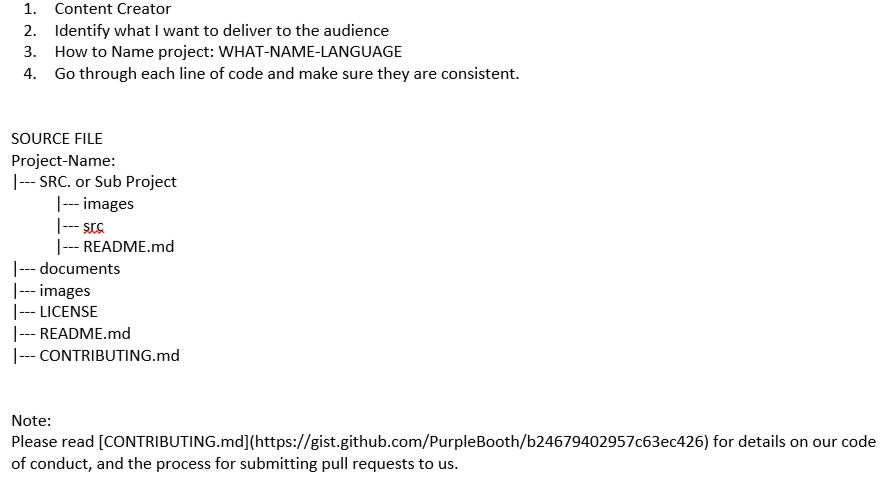

# Human Computer Interface Research

## Grading Project:
- Semester Project (40% of overall grade – broken down below): There is a semester-long project that gives you an opportunity to develop the full 
range of skills that is needed for HCI work.
- Elevator Pitch (5%) – 30 second pitch to garner support from a Stakeholder or VC
- User Study I (7%) – Design and run a user study
- Initial Design prototype (10%) – Low Fidelity that can be shown to users
- User Study II (7%) – Design and run a follow up user study
- High Fidelity Prototype (5 %) - Working prototype 
- Iteration /polished product (6%) – Documentation that illustrates the notable changes/lessons learned from the first Iteration and the user 
studies

## Phase:
- Phase 1 – Form Group and Project ✅
- Phase 2 – Requirements and First Prototype
- Phase 3 – Test and Evaluate
- Phase 4 – Implement changes, finish

## Tasks
- Form Groups ✅
- Problem Space ✅
- Requirements
- Design Alternatives
- Prototypes
- Testing Design/ Evaluating Design
- [Presentation](#)
- Final Deliverables

#### Form Groups ✅
- Done

#### Problem Space ✅
- Web Design? What Do You Think?
- How about upgrade an ecommerce website (hp.com they doesn't look very efficeient to me)

#### Requirements
- Task 1: [documents](https://ind657-my.sharepoint.com/:w:/g/personal/huyntl02_pfw_edu/EYzoQR0YaiJNgZKrPOAXBOgBNg605YOvDfJplSy5hFLN5A?e=Z3eiiq)

#### Design Alternatives
- if go with ecommerce what we need to do?

#### Personality Traits:


#### Prototypes

#### Testing Design/ Evaluating Design

#### Presentation

#### Final Deliverables
- Tools:
- Requirements:
```
Final App should be functional than just a prototype.
- HTML, CSS, JavaScript, Python (Flask) ???

```

## Set up for communcation and work Space

### How to Navigate in this GitHub Repo


### How we can commuicate:
- Slack/Discord ???
- [Click to join meeting for Slack](https://join.slack.com/t/humaninterfac-uiv5452/shared_invite/zt-12behkwtz-dMhX22kVD_Cg_rq1MVa2pQ)

### How we can collaborate:
- GitHub: Git can record what we did in log form. We do not have to worry about going back in time

## Contributing
Please read [CONTRIBUTING.md](CONTRIBUTING.md) for details on our code of conduct, and the process for submitting pull requests to us.

## Versioning

We use [SemVer](http://semver.org/) for versioning. For the versions available, see the [tags on this repository](). 

## Authors
* **Truc Huynh** - *Initial work* - [TrucDev](https://github.com/jackyhuynh)

## Format
my README.md format was retrieved from
* **Billie Thompson** - *Initial work* - [PurpleBooth](https://github.com/PurpleBooth)

## License

This project is licensed under the MIT License - see the [LICENSE.md](LICENSE.md) file for details

## Acknowledgments
* Any acknowledgments go here
