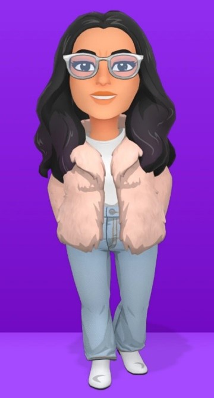
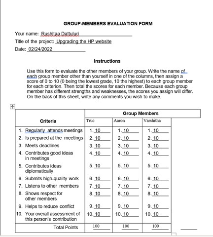
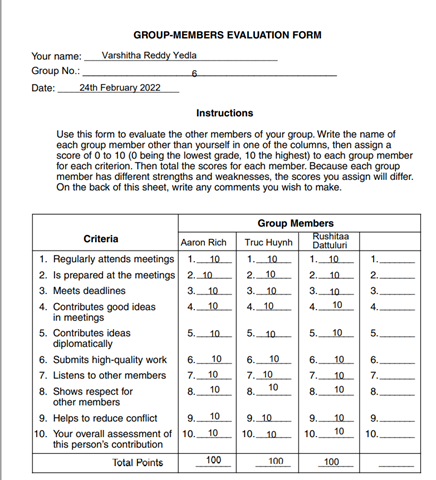

# Personas

## [Online Version](https://github.com/jackyhuynh/human-computer-interface-research/blob/main/documents/personas.md)

## GROUP-6
- Truc Hunyh
- Aaron Rich
- Rushitaa Dattuluri
- Varshitha Yedla Reddy

## I) User Personas:
### User 1:

##### Name:
```
    Peter Han
```

##### Images:


##### Demographic: 
  - Customer, Personal Use, Business Use
  - 34 years old male
  - Lives in Fort Wayne, Indiana
  - Married with 2 children
  - Has 1 brother and 2 sisters
  - Own a trading company
  - Has a middle-income level & a profitable business

##### Personality Traits (3):
  - Purposeful
  - Self-directing
  - Resourceful
  - Procrastinator 
  - Detail-oriented
  - Solid
  - Detail-oriented
  - Experienced customer, has good knowledge of computers and hardware
  - Summary:
    
    Peter is an experience businessman. He pay high attention to details. 
    As a busy person, Peter doesn't waste his time (Time is money). 
    Also as an experience IT, people come to Peter ask for advises.
    He uses his phones, or computers to search for products (computers) through all sources(Amazon, Ebay, Dell, HP) to find the best deal.
    
    On big order (10 computers or more), Peter usually navigate carefully and have a list of specification requirements.
    Peter like to go back to the business that he has good experiences and shop there again

##### User's motivations (3):
  - Peter looks for reliability and robustness in products
  - Peter wants the warranty is at least 4 years or more on any products (buy or free)
  - For Clients: 
    - Peter wants the products price is cheapest as much as possible (cheap but must meet requirements)
    - Discount if buy in bunk
    - Able to retrieve his orders in a timely manner(few click and short)
  - For himself
    - Want to make sure that the product works as fast as his mind (Demanding).
    - The hardware should have longer durability (battery, keyboard, etc.)

##### Limitations (3):
  - Peter is tech-savvy and uses the latest iPhones. He expects things work in a snap. He loses his patient and jumps to another pages if their navigation is complicated
  - Peter expects websites (HP.com for examples) show him what he needs in a matter of a few click (price must be competitive also)
  - Peter wants the latest technology with the cheapest price
  - Impulsive

### User 2:

##### Name:
```
    Nancy Vera
```

##### Images:


##### Demographic: 
  - Customer, Personal Use, school work
  - 22 years old female
  - Lives in Fort Wayne, Indiana
  - Single with no children
  - Computer Sciences Students at PFW
  - Pay for her tuition, and rent
  - Working part-time at a teaching assistant, and cashier
  - Has a low-income level
  - Play video games
  - Live in dom

##### Personality Traits (3):
  - Self-directing
  - Reliable
  - Purposeful
  - Scholarly
  - Shy
  - tech-savvy
  - “Not so impulsive” buyer
  - Interested in business and global affairs 
  - Detail-oriented 
  - Has a liking for design and aesthetics
  - Summary:
    
    Nancy is an undergraduate in computer science at Purdue University Fort Wayne. She's 21 years old and working two part-time jobs to pay for her tuition and housing. Nancy currently has a student loan and lives on a tight budget.  Her parents live in Georgia. 
  
    Nancy is working part-time as a teaching assistant and a cashier at a local store. Nancy wants to purchase a new computer for her schoolwork, and she is looking for a high-end computer. She intends to use her new computer for the next coming school-year and after graduation.
    
    Nancy is interested in tech and she loves an element computer with great graphic (MacBook for example)

##### User's motivations (3):

  - Lookout for products and services that increase efficiency
  - has an eye for affordable yet fancy-looking items
  - Looking for products with a higher lifespan
  - Students discount because of tight budgets

##### Limitations (3):

  - shoestring budget
  - impatient
  - tentative and indecisive

### Functional requirements (10):

#### Peter Huynh (entrepreneur):
  - As a customer I want the website to be user-friendly and easy to navigate
  - As a customer I want the website to have relevant categories in each tab 
  - As a customer I would like the website to display my orders and order history
  - As a customer I would like the website to be quick in response and loading the information.
  - As a customer I want to see all my discount show up.

#### Nancy Vera (computer science student):
  - As a customer, I want the website to have a mobile responsive design so that it is easier for making purchases through mobile.
  - As a customer, I want the website to log me in using my google or Facebook account as it is less time-consuming.
  - As a customer, I want the website to allow UPI payments so that it is faster and more secure.
  - As a customer, I want the website to display the product attributes when viewing the product.
  - As a customer, I want the website to display recommended items based on my previous purchases and searches.
  - As a customer, I want each step to be self-explanatory and minimal so that my entire attention is on the product and not on figuring out the working of the website.

## II) Requirements
  - As a customer I would like the website to display my orders and order history.
  - As a customer, I want each step to be self-explanatory and minimal so that my entire attention is on the product and not on figuring out the working of the website.
  - As a customer I want the website to be user-friendly and easy to navigate.
  - As a customer I want the website to have relevant categories in each tab.
  - As a customer, I want the website to display the product attributes when viewing the product.

## User’s Relationship with the Product: 
Answer these four questions through the lens of both personas created in question:
#### 1) How will the user interact with the product?
- Through hp.com website where we list all the possible products (laptop, desktop, gaming computer(laptop, desktop), printer...) 

#### 2) What need will the product satisfy for the user?
- It helps the customers to shop from the comfort of their own homes. 
- Helps them research more about the different products available in the market.
- Can make the purchase at their own pace and hence have no regrets after the purchase is done.

#### 3) How is the user currently satisfying this need?
- Cheapest price possible with best performance
- Elegant look and feel

#### 4) How much will the user be willing to spend on the product?
- Peter Huynh:
```diff
- Business Use
+ Desktop: less than $ 1000
+ Laptop: less than $ 800
+ Printer: less than $ 200
+ Looking for bunk discount

- Personal Use:
+ Desktop: less than $ 2000
+ Laptop: less than $ 2200

- Personal Use:
+ Desktop Gaming: less than $ 2000
+ Laptop Gaming: less than $ 1800
+ Printer: less than $ 300 
```
- Office: Considering how big or small the business is, we are assuming our target purchases to be between 10-200 units of PC, printers, scanners, etc.


- Nancy Vera:
```diff
- Personal Use:
+ Desktop: less than $ $600-$750
+ Laptop: less than $ 200
+ Desktop Gaming: less than $ 2000
+ Laptop Gaming: less than $ 1800
+ Printer: less than $ 300 
```

## Group evaluations:
### Truc Huynh


### Aaron


### Rushitaa



### Varshitha

